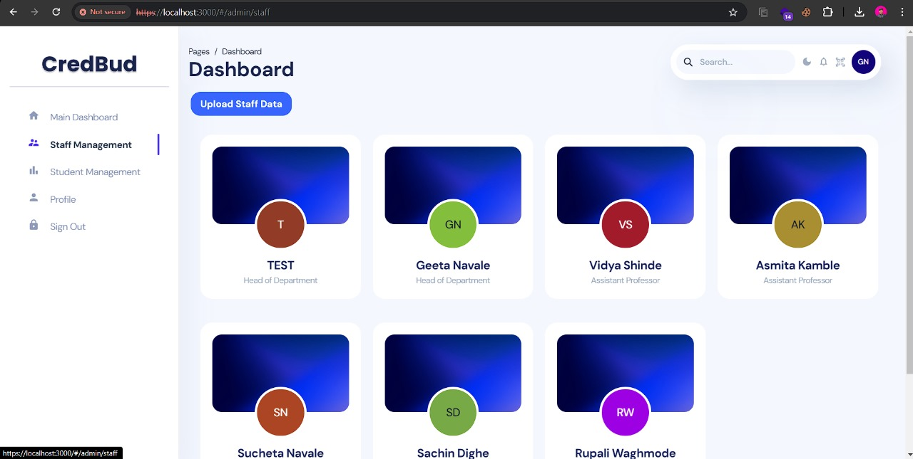
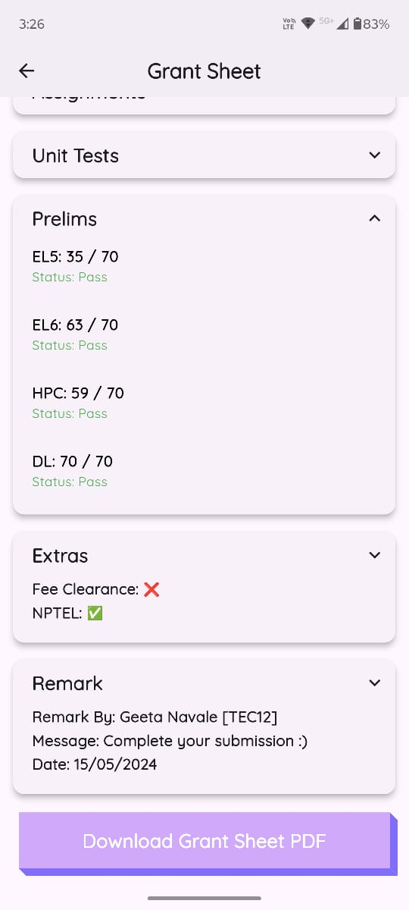

# Gradbud

# 🎓 GradBud — Student Engagement & Academic Integrity Platform

**GradBud** is a full-stack platform designed to **boost student engagement**, ensure **academic integrity**, and streamline **attendance and reward management** in educational institutions.

The system enables secure tracking of participation, gamified reward distribution, and transparent faculty-student interaction — all through a unified web and mobile experience.

---

## 🎯 Purpose & Benefits

### **For Students**
- Track attendance, achievements, and participation in real time ✅  
- Earn **rewards** and **badges** for consistent engagement 🏆  
- Access personalized dashboards for academic progress 📊  
- Strengthen accountability with secure attendance verification 🔒  

### **For Faculty & Institutions**
- Automate attendance tracking and reward distribution ⚡  
- Gain actionable insights into student engagement patterns 📈  
- Promote integrity with transparent, tamper-proof attendance 📜  
- Simplify administrative workflows and reporting 🖥️  

---

## 📱 GradBud Screenshots

  
  
  

  
  
  

  
  

